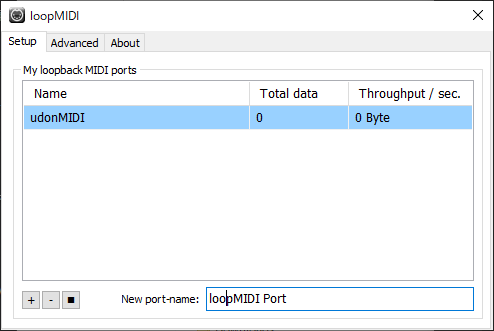
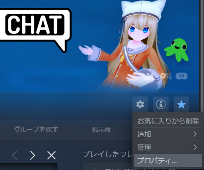
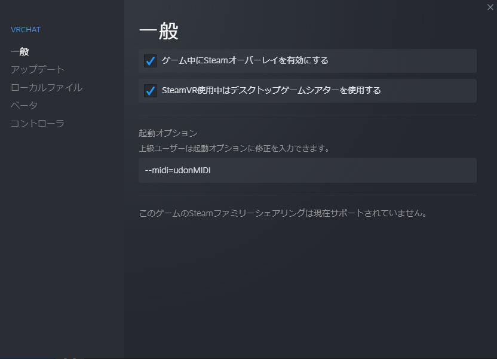
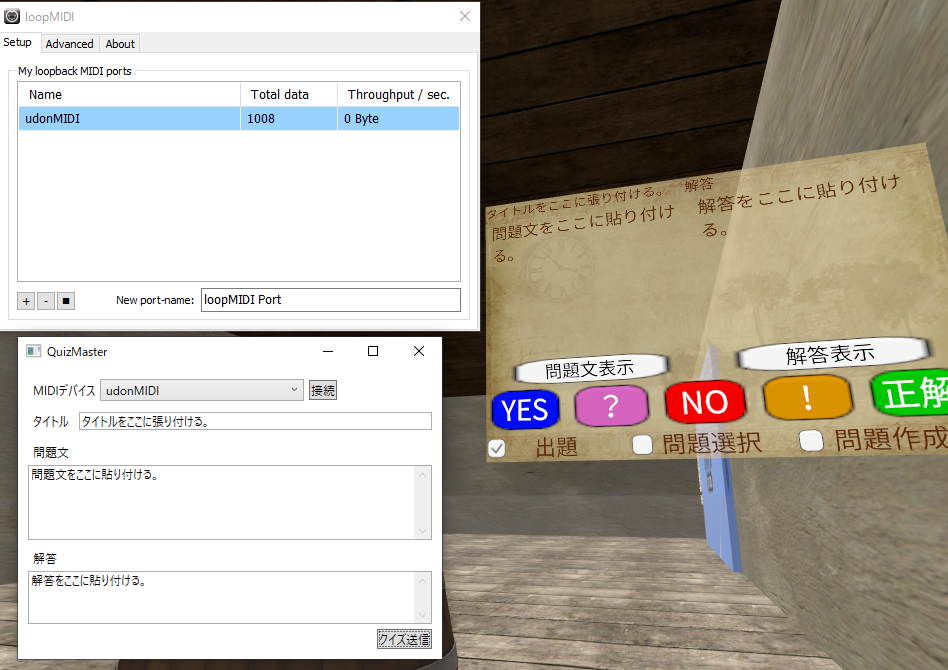
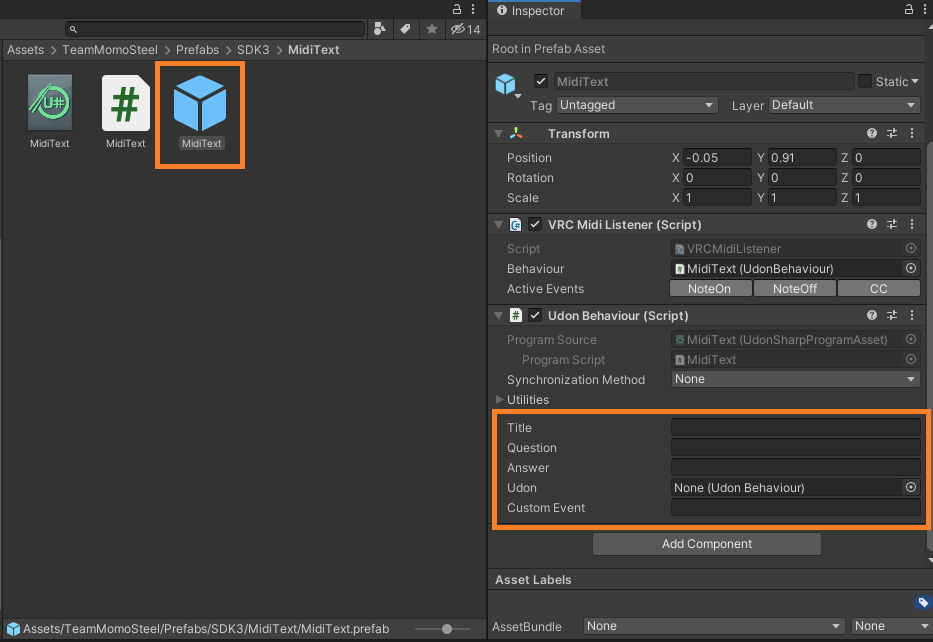

# UdonMidiLibrary

## 概要

UdonMidiLibraryはVRChatのワールドに対して、MIDIを介して文字列を送信するライブラリです。
サンプルとして「タイトル、問題文、解答文」の3つの文字列をワールドに送信するQuizMasterというアプリケーションも用意しています。

## ダウンロード

[ダウンロード](Release/QuizMaster.zip)

## 前準備

### loopMIDI



- [こちらのインストール手順](https://canplay-music.com/2019/12/14/loopmidi/)を参考に[loopMIDI](https://www.tobias-erichsen.de/software/loopmidi.html)をインストール。
- loopMIDIを起動してNew port-nameに「udonMIDI」と入力して「+」ボタンを押下。
  - 「udonMIDI」という名前の仮想MIDI入出力デバイスを追加する。
- QuizMasterを起動する前にloopMIDIを起動しておく。

### VRChat





- VRChatの[起動引数](https://docs.vrchat.com/docs/launch-options)で追加したMIDI入力デバイスを指定する。
  - SteamのVRChatの管理>プロパティ。
  - 起動オプションに「--midi=udonMIDI」を追加する。

## 使用方法-QuizMaster



- UdonMidiLibraryに対応したワールドに移動する。
  - [UmigameSoup-ウミガメのスープ](https://vrchat.com/home/world/wrld_4b3b0a74-b96c-4d65-ae6d-547419b6ec9d)
    - 解答権を得るとMIDIの入力が可能になる。
- QuizMasterでMIDIデバイスのリストから「udonMIDI」を選択する。
- 接続ボタンを押下。
- タイトル、問題文、解答を入力する。
- クイズ送信ボタンを押下。

## 使用方法-UdonMidiLibrary

```C#
// usingにUdonMidiOutputを指定。
using UdonMidiOutput;

public class MidiSendScript
{
    // MIDI出力デバイスの一覧はMidiOutputDeviece.GetDeviceName()で取得。
    private string[] _list = MidiOutputDeviece.GetDeviceName();

    // コンストラクタでデバイス名を指定して接続。
    private UdonTextOutput _midi = new UdonTextOutput("udonMIDI");

    public void SendMessage()
    {
        // SendTextでチャネル番号を指定子て文字列を送信。
        _midi.SendText(0, "あいうえお");
    }
}
```

## 使用方法-MidiText



- Assets>TeamMomoSteel>Prefabs>SDK3>MidiText>MidiText.prefabをワールドに配置する。
- 文字列を受信した際に呼び出して欲しいオブジェクトとイベント名を指定する。
  - Udon：イベントを呼び出す対象のUDON。
  - Custom Event：呼び出すイベント名。
- 受信した文字列はそれぞれTitle,Question,Answerに格納されているのでそこから取得する。